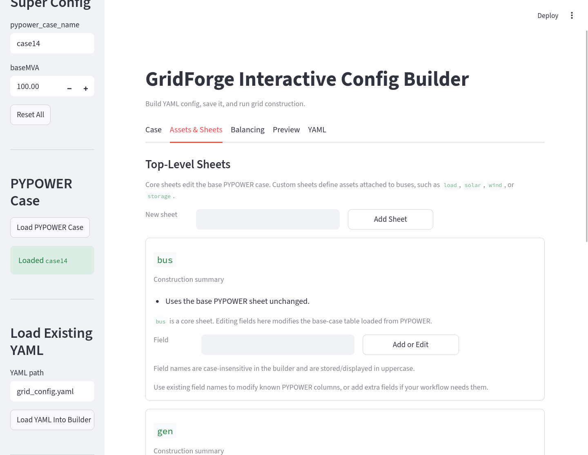
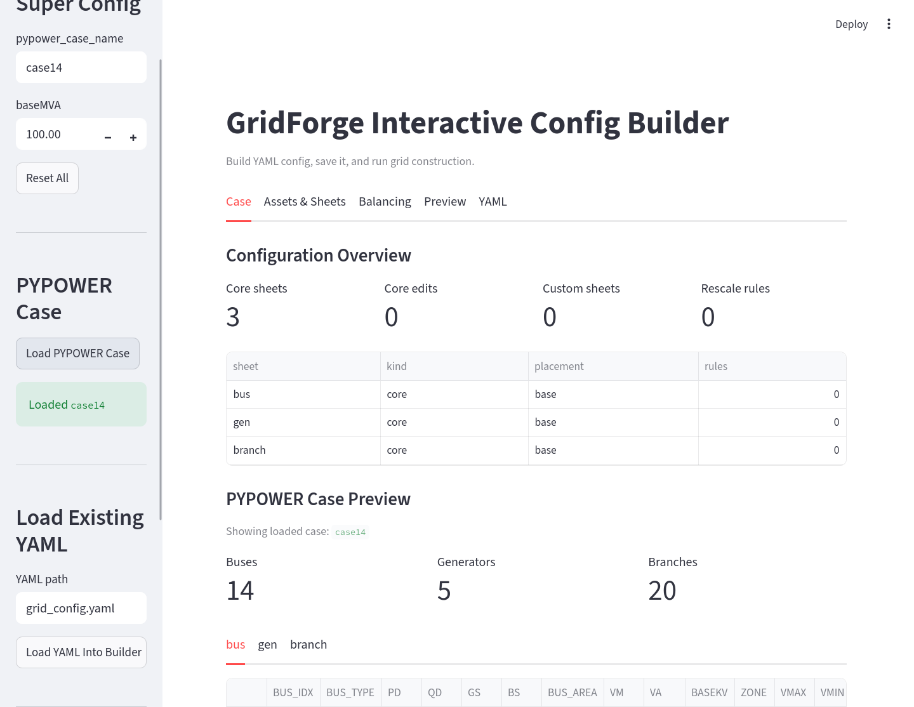
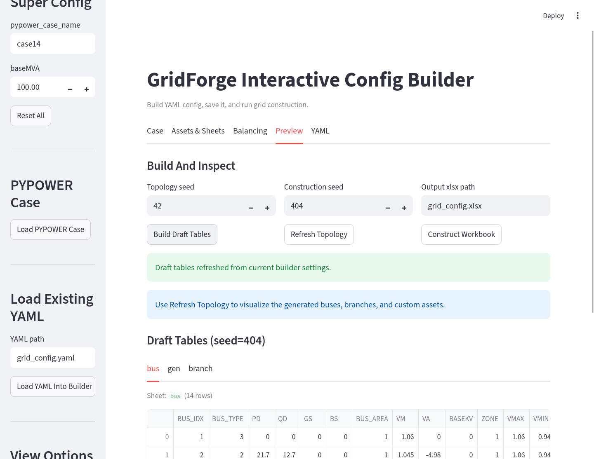
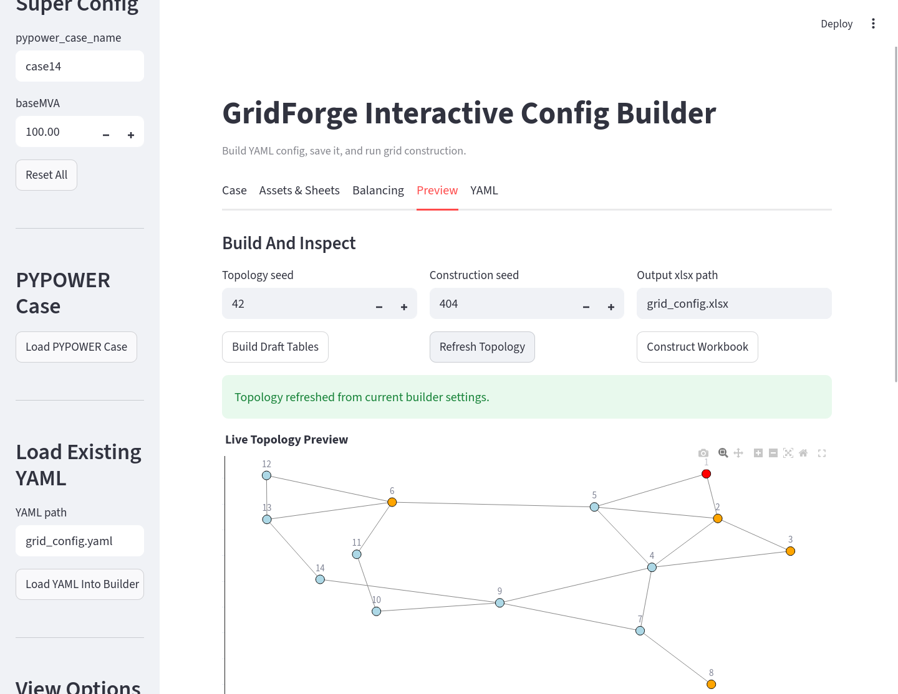
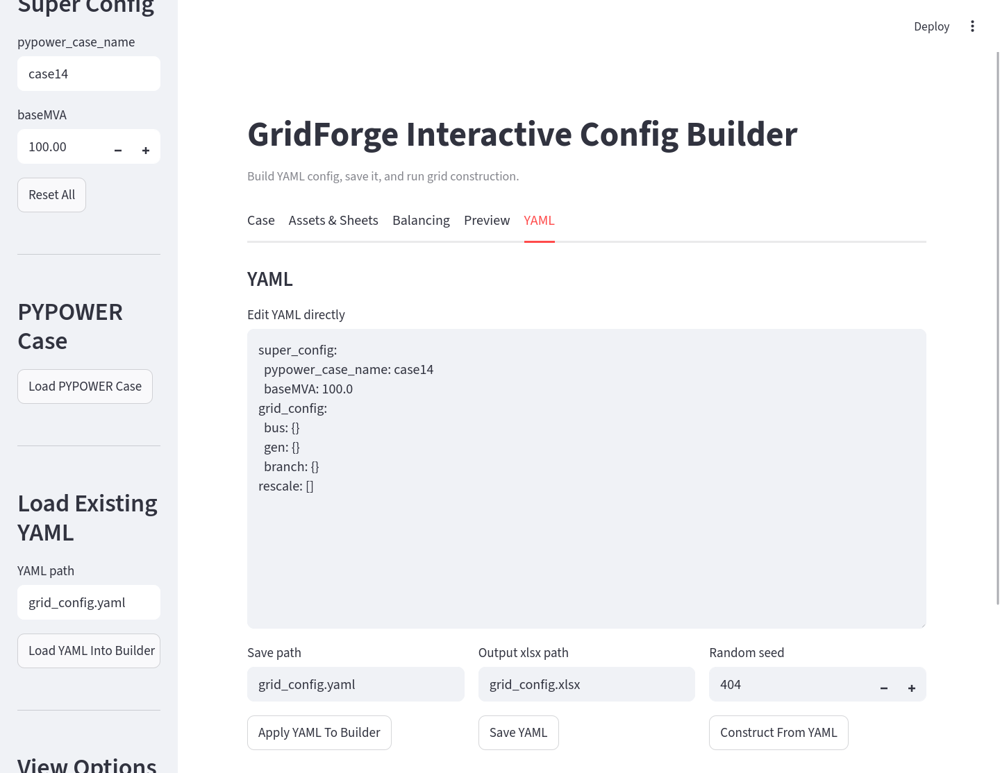

# Visual Config App

GridForge includes a Streamlit app for building the same grid YAML file that
can also be written by hand. The app is useful when you want to inspect a base
case, add custom sheets, preview generated tables, and save a configuration
without editing every YAML block manually.

The visual app covers the static grid-construction stage. Bus-data assignment
is still handled by the assignment YAML and Python helpers described in
[Bus Data Assignment](bus-data-assignment.md).

<p align="center">
  
</p>

## Install App Dependencies

If GridForge is installed from a local checkout, install the app extra:

```bash
pip install -e ".[app]"
```

For the app plus optional plotting dependencies:

```bash
pip install -e ".[full]"
```

If GridForge is installed from PyPI, include the app extra:

```bash
pip install "powergridforge[app]"
```

## Launch

After installation, run:

```bash
gridforge-app
```

From a source checkout, this command is equivalent to:

```bash
streamlit run gridforge/config_app.py
```

Streamlit prints a local URL in the terminal, such as
`http://localhost:8501`. Open that URL in a browser.

If the port is already in use, kill or choose another one.

## What The App Builds

The app helps author the grid YAML used by `construct_grid_config(...)`.
Through the app, you can:

- choose a built-in PYPOWER case such as `case14`,
- point to a local PYPOWER `.py` case or MATPOWER `.m` case,
- edit the top-level grid settings such as `baseMVA`,
- add or modify core sheets such as `bus`, `gen`, and `branch`,
- create custom bus-attached sheets such as `load`, `solar`, `wind`, or
  `storage`,
- define `BUS_IDX` placement rules for custom sheets,
- set absolute values or relative values based on another sheet,
- add rescale rules to match totals across sheets,
- preview the resulting workbook sheets before saving.

<p align="center">
  
</p>

The output is a normal GridForge YAML file. You can commit it, edit it by hand,
or pass it directly to:

```python
from gridforge.construct import construct_grid_config

construct_grid_config(
    "examples/14bus_uc/14bus_config.yaml",
    "examples/14bus_uc/14bus_config.xlsx",
)
```

## Preview The Base Case

Use **Load PYPOWER Case** to inspect the selected base case before adding
custom rules. This helps confirm the number of buses, generators, and branches
that the YAML will modify.

<p align="center">
  
</p>

## Preview The Generated Workbook

Use **Build Draft Tables** to preview the workbook sheets generated from the
current builder state without writing the final Excel file.

<p align="center">
  
</p>

Use **Refresh Topology** to render an interactive network view of the generated
buses and branches. Bus colors distinguish the bus types from the base case, and
the hover text reports any custom assets attached to a bus.

<p align="center">
  
</p>

## Edit Or Export YAML

The **YAML** tab exposes the same configuration as editable text. This is useful
when you want to copy a setting, make a small manual edit, or save the YAML file
as the source of truth for a case.

<p align="center">
  
</p>

## Where It Fits In The Workflow

Use the app in Stage 1:

```text
Base PYPOWER/MATPOWER case
  -> visual app or hand-written YAML
  -> generated Excel workbook
  -> bus-data assignment
  -> Grid(...) and Data(...)
  -> optimization model
```

The important boundary is that the app defines static grid structure. It does
not decide which time-series CSV file should be assigned to each bus. That
second step is handled after the workbook exists, because GridForge needs the
generated `BUS_IDX` values from the workbook before it can materialize
bus-specific CSV files.

## Recommended Use

Start with the app when you are exploring a new case or designing custom asset
sheets. Once the YAML is stable, keep it as the source of truth and rebuild the
Excel workbook from that YAML whenever the grid design changes.
