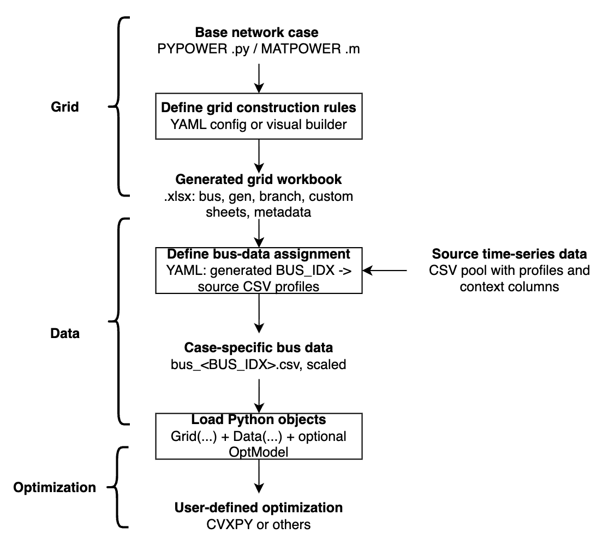

# Workflow


GridForge turns a base power-system case into optimization-ready Python data in
four stages:

```text
1. Static grid construction
   User-defined YAML rules + MATPOWER/PYPOWER base case -> Full Excel workbook

2. Time-series assignment
   source data pool + assignment config YAML -> case-specific bus_<BUS_IDX>.csv files

3. Python access
   Excel workbook -> Grid(...) class instance
   case-specific CSVs -> Data(...) class instance

4. Optimization
   Grid + Data -> user-defined optimization model in CVXPY or another optimization tool
```

<p align="center">
  
</p>

GridForge also comes with a ready-to-use dataset from [TX-123BT system](https://www.sciencedirect.com/science/article/pii/S2352467725001560) which is a synthetic Texas power system with time-series weather-dependent spatiotemporal profiles.

> Note: TX-123BT is optional. It is one example source for producing a pool of per-bus
> CSV files, not a signal for GridForge itself.

## Stage 1: Build The Grid Workbook

GridForge starts from a PYPOWER/MATPOWER-style case and applies YAML rules. The YAML file describes static changes: which columns to overwrite, which custom asset sheets to create, where those assets sit in the network, and how totals should be rescaled.

The user should specify the name of a pypower case or a local PYPOWER/MATPOWER-sytle case file in .py or .m format. The user can then modify the grid configuration by adding or modifying grid assets with YAML files.

The YAML can be written manually or created with the
[Visual Config App](visual-app.md).

Once the yaml file is ready, the user can construct the grid configuration by running the following code:

```python
from gridforge.construct import construct_grid_config

construct_grid_config(
    "examples/14bus_uc/14bus_config.yaml",  # user-defined YAML rules
    "examples/14bus_uc/14bus_config.xlsx",  # output Excel workbook
    random_seed=404,
)
```

The generated Excel workbook contains core sheets: `bus`, `gen`, and `branch`.

and any custom asset sheets attached to buses, such as:`load`, `solar`, `wind`, `storage`, etc.

Generator cost data from PYPOWER/MATPOWER `gencost` is merged into `gen` as `COST_*` columns, for example `COST_STARTUP`, `COST_FIRST`, and `COST_ZERO`.

For the full YAML schema, see [configuration.md](configuration.md).

## Stage 2: Assign Bus Data

The grid config decides which assets exist and where they sit. Time-series data
is attached later through a separate bus-level assignment file, so static assets
do not automatically require CSV data.

Only workbook sheets referenced by `signals.<name>.workbook_sheet` are treated
as data-backed. For each signal, GridForge reads that sheet's `BUS_IDX` values
from the Excel workbook to know which generated buses require data.

```python
from gridforge.data import (
    load_bus_data_assignment,
    prepare_bus_data,
)

assignment_template = load_bus_data_assignment("examples/14bus_uc/14bus_data_assignment.yaml")
assignment, materialized = prepare_bus_data(
    grid_xlsx_path="examples/14bus_uc/14bus_config.xlsx",
    source_data_dir="data/bus_data",
    signals=assignment_template["signals"],
    output_data_dir="examples/14bus_uc/14bus_data",
    resolved_assignment_path="examples/14bus_uc/14bus_data_assignment_resolved.yaml",
    random_seed=404,
)
```

This reads source data files and writes case-specific files such as:

```text
examples/14bus_uc/14bus_data/bus_2.csv
examples/14bus_uc/14bus_data/bus_3.csv
```

For assignment schema, scaling rules, and suggested mappings, see
[bus-data-assignment.md](bus-data-assignment.md).

## Stage 3: Load Grid And Data

```python
from gridforge.opt import Grid, Data

grid = Grid(
    "examples/14bus_uc/14bus_config.xlsx",  # input Excel workbook from Stage 1
    verbose=0,
)

data = Data(
    grid_xlsx_path="examples/14bus_uc/14bus_config.xlsx",  # input Excel workbook from Stage 1
    data_dir="examples/14bus_uc/14bus_data",  # input directory for case-specific bus_<BUS_IDX>.csv files
    sheet_names=["load", "solar", "wind"],
)
```

`Grid(...)` exposes the static workbook as arrays, DataFrames, and incidence
matrices:

- `grid.sheets[...]`: raw Excel sheets as pandas DataFrames
- `grid.core.*`: schema-defined core sheets
- `grid.custom[...]`: generic custom sheets attached to buses
- aliases such as `grid.gen`, `grid.branch`, `grid.load`, and `grid.solar`

`Data(...)` loads time-series matrices aligned to the workbook row order. This
alignment is what lets `grid.load.Cbus @ load[t]` map a time-series vector to
bus injections correctly.

For detailed access patterns, see [grid-data-access.md](grid-data-access.md).

## Stage 4: Build An Optimization Model

GridForge does not prescribe a fixed optimization model. You can use `Grid`,
`Data`, and `OptModel` to assemble your own formulation in CVXPY or another
optimization tool.

```python
import cvxpy as cp
from gridforge.opt import OptModel

T = 24
m = OptModel(grid)

m.add_variable("pg", (T, grid.gen.n))
m.add_parameter("load", (T, grid.load.n))

pg = m.vars["pg"]
load = m.params["load"]

for t in range(T):
    injection = grid.gen.Cbus @ pg[t] - grid.load.Cbus @ load[t]
    m.add_constraint([
        cp.sum(injection) == 0,
        grid.branch.ptdf @ injection <= grid.branch.pmax / grid.baseMVA,
        grid.branch.ptdf @ injection >= -grid.branch.pmax / grid.baseMVA,
    ])

prob = m.compile(load=data.get_series("load")[:T, :] / grid.baseMVA)
```

The full unit-commitment example is in
[14bus_example.py](https://github.com/xuwkk/gridforge/blob/main/examples/14bus_uc/14bus_example.py).

## Visual Config App

The Streamlit app is a visual YAML builder for Stage 1. It edits the same YAML
format used by `construct_grid_config(...)`.

```bash
gridforge-app
```

From a local checkout:

```bash
streamlit run gridforge/config_app.py
```

For installation notes and the boundary between the visual app and bus-data
assignment, see [visual-app.md](visual-app.md).

## Optional TX-123BT Source Data

GridForge includes an optional TX-123BT workflow that prepares a public source
CSV pool under `data/bus_data/`.

```bash
bash scripts/generate_tx123bt_bus_data.sh
```

This is not required for GridForge. It is one example data source that can feed
the generic bus-data assignment step.

For details, see [tx123bt.md](tx123bt.md).
