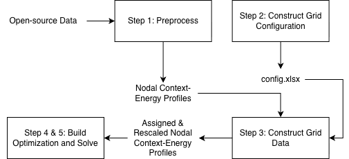

# GridForge

<p align="center">
  
</p>


**GridForge** is an automatic power system configuration, data, and optimization generator, designed to help power system researchers to quickly generate testbeds for optimization and machine learning studies. It is built to overcome the following pitfalls of existing power system testbeds:
1. **Data**: under a network setting, *spatio-temporal* data (including load and renewable generation) on each bus is required. 
2. **Grid**: the grid configuration provided in `pypower` (a Python mirror of `matpower`) does not include configurations for *complex power system optimizations* such as unit commitment, etc.
3. **Data-Grid-Optimization**: the data should be *compatible with the grid configurations*, such as generator capacity, transmission line capacity, etc.
4. **Machine learning**: for a forecasting task, the spatio-temporal data should come with *contexts* such as weather information to build supervised learning models.

GridForge currently supports the following features:
1. Enhance the existing `pypower` test system by adding new entries such as generator ramps, renewable generators, etc.
2. The configurations can be interfaced by `cvxpy` so that the user can design their own optimization problems quickly.
3. Based on open-source nodal weather, load, and renewable generation data over a year, GridForge can automatically rescale the data based on the grid configurations.

> Note: GridForge can generate configurations and data compatible with CVXPY modeling; solvability depends on whether the resulting formulation is DCP/DQCP and on the chosen solver (especially for mixed-integer UC). See [the optimization classes supported by cvxpy](https://www.cvxpy.org/tutorial/solvers/index.html#choosing-a-solver).

> Note: GridForge is originally designed for our previous work [LAPSO: Learning Augmented Power System Optimization](https://github.com/xuwkk/lapso_exp). Now we publish it as a standalone package.

## Installation

**Install from GitHub (recommended)**

```bash
pip install "git+https://github.com/xuwkk/gridforge.git@v0.0.2"
```

**Install latest commit**

```bash
pip install "git+https://github.com/xuwkk/gridforge.git"
```

**Editable install for development (local clone)**

```bash
git clone https://github.com/xuwkk/gridforge.git
cd gridforge
pip install -e .
```

**Optional: Gurobi support**

```bash
pip install "git+https://github.com/xuwkk/gridforge.git@v0.0.2#egg=gridforge[gurobi]"
```


## How to use

Using GridForge is straightforward. It starts from downloading open-source grid operational data, followed by generating grid configurations by user's choice, and finally output the grid specification in `.xlsx` format and compatible spatio-temporal data in `.csv` format.

<p align="center">
  
</p>


We go through the [IEEE 14-bus system](examples/14bus_uc) as an example.

### Step 1: Preprocess the raw data

We use the data from open-souce [TX-123BT system](https://rpglab.github.io/resources/TX-123BT/) and [the paper: A synthetic Texas power system with time-series weather-dependent spatiotemporal profiles](https://www.sciencedirect.com/science/article/pii/S2352467725001560). 

First download the data [here](https://figshare.com/ndownloader/files/39478540). Copy the ```.zip``` file under `data/` and rename it to `raw_data.zip`.

Then run the following command to unzip and preprocess the data in command line:
```bash
unzip -n ./data/raw_data.zip -d ./data/
```
And then
```python
import numpy as np
from tqdm import tqdm
from gridforge.preprocess import preprocess_raw_data, sanity_check_bus_csv

preprocess_raw_data()

# Check if the data generation is correct
no_day = 365
no_bus = 123
np.random.seed(42)  # for reproducibility
bus_idx_list = np.random.randint(1, no_bus + 1, size=20)
for bus_idx in tqdm(bus_idx_list, desc="Sanity checking per-bus files"):
    sanity_check_bus_csv(
        bus_idx = bus_idx, no_day=no_day)
```

> **About the dataset.** The dataset from the above link is preferable for GridForge as it contains data that has both temporal and spatial correlations (see pitfall 1. Data). The weather data, as well as load and renewable generation data is allocated to each bus in one system (see pitfall 4. machine learning). If you are aware of other datasets with similar properties, please let us know!

The data associated to each bus (there are 123 buses in total) will be saved in `data/bus_data/bus_{idx}`. Each dataframe contains columns ['Weekday_sin', 'Weekday_cos', 'Hour_sin', 'Hour_cos', 'Temperature (k)', 'Shortwave Radiation (w/m2)', 'Longwave Radiation (w/m2)', 'Zonal Wind Speed (m/s)', 'Meridional Wind Speed (m/s)', 'Wind Speed (m/s)', 'Load', 'Solar', 'Wind']. Each bus has at most one renewable plant (solar or wind). The periodicity features such as weekday and hour are represented by the cosine and sin waves with corresponding periods.

> **Preprocessing time.** Step 1 may take several minutes as the raw data is large. After the first time, you can skip this step and directly use the preprocessed data in `data/bus_data/`.

### Step 2: Construct grid configurations

[PyPower](https://github.com/rwl/PYPOWER) (or matpower) provides comprehensive configurations for power system networks. See the bus14 example online [here](https://github.com/rwl/PYPOWER/blob/master/pypower/case14.py). The PyPower configurations contain the basic power system information, and to be able to implement complex operations such as unit commitment, **extra configurations are needed**. 

GridForge is built upon the PyPower configurations and the user is asked to provide a configuration file (in `.yaml` format), where the new entries can be added either by absolute values or relative values to some **key configurations** in a PyPower settings. Detailed conversion rules are provided in [`config_definition.md`](config_definition.md). An example configuration file is provided in [`14bus_config.yaml`](examples/14bus_uc/14bus_config.yaml) for augmenting the IEEE 14-bus system.

After creating your configuration file, you can generate the grid configuration using:

```python
from gridforge.construct import construct_grid_config

config_path_yaml = "14bus_config.yaml"
config_path_xlsx = "14bus_config.xlsx"
random_seed = 404  # Set random seed for reproducibility

construct_grid_config(config_path_yaml, config_path_xlsx, random_seed)
```

This will create an Excel file with sheets for `bus`, `gen`, `gencost`, `branch`, `load`, `solar`, and `wind` (if specified in your config).

### Step 3: Prepare bus data

After generating the grid configuration, you need to assign and rescale the preprocessed bus data to match your grid configuration:

```python
from gridforge.construct import construct_grid_data
data_dir = "14bus_data"
verbose = 0
construct_grid_data(config_path_xlsx, data_dir, random_seed, verbose=verbose)
```

This function will:
- Assign preprocessed data (Step 1) from `data/bus_data/` to each bus in your grid configuration. Each bus will now be associated with load, solar, and/or wind data profiles and the corresponding contexts.
- Rescale the data based on the capacity specified in the grid configuration.
- Save the processed data as CSV files (`bus_{idx}.csv`) in the specified output directory.

> **Note:** The `random_seed` parameter ensures reproducibility. Use the same seed for both `prepare_grid_from_pypower` and `prepare_data` to get consistent results across runs.

### Step 4: Build your own optimization problem

You can now build your own optimization problem using the grid configuration and data. A complete example is provided in [`14bus_example.py`](examples/14bus_uc/14bus_example.py). Three classes are specified as
- `Grid`: containing the grid configuration,
- `OptModel`: containing the optimization model, and
- `Data`: containing the data.
where the `data` and `grid` will be built automatically. You can also inherit from these classes to build more tailored formulations.

```python
from gridforge.opt import Grid, OptModel, Data

T = 24

data = Data(grid_config_path, config_path, data_dir, entry_name=["Load", "Solar", "Wind"])
grid = Grid(grid_config_path, config_path, verbose=verbose)
m = OptModel(grid)
```

The load, solar, and wind data are stored in `data.load_data`, `data.solar_data`, and `data.wind_data` respectively. You can access all the grid information:
```python
print(grid.nbus) # number of buses
print(grid.bus_component) # bus component
print(grid.gen_component.pmax) # generator capacity
print(grid.gencost_component['first']) # generator cost coefficient
```

You can use the function `add_variable`, `add_parameter`, `add_constraint`, and `add_objective_term` in the `OptModel` class to build your own optimization problem. For example,
```python
m.add_parameter("load", (T, grid.nload))
m.add_variable("ug", (T, grid.ngen), is_binary=True)
m.add_variable("yg", (T, grid.ngen), is_binary=True)
m.add_variable("zg", (T, grid.ngen), is_binary=True)
m.add_constraint([
    yg[t] + zg[t] <= 1 for t in range(T)
])
m.add_objective_term(cp.sum(cp.multiply(grid.gencost_component['startup'], m.vars['yg'])))
```

### Step 5: Solve the optimization problem

Then compile the optimization problem by providing the parameters and solve it:

```python
parameters = {
    "load": data.load_data[idx:idx+T, :] / grid.baseMVA,
    "solar": data.solar_data[idx:idx+T, :] / grid.baseMVA,
    "wind": data.wind_data[idx:idx+T, :] / grid.baseMVA
}
prob = m.compile(**parameters)
prob.solve(solver = "GUROBI")
print(prob.status)
```

Again see the complete example in [`14bus_example.py`](examples/14bus_uc/14bus_example.py).