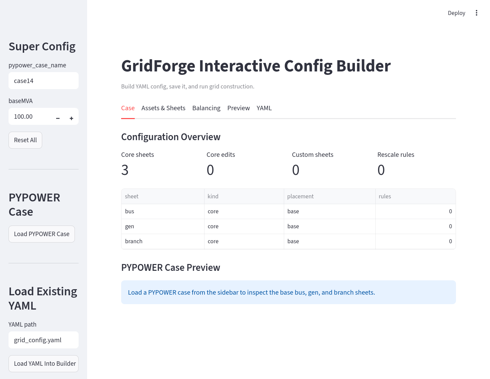

# GridForge

<p align="center">
  
</p>

**GridForge** helps build optimization-ready power-system cases from standard
PYPOWER/MATPOWER grids. It lets you describe grid edits in YAML, generate a
structured Excel workbook, attach bus-level time-series data, and load the
result into Python for your own optimization model.

GridForge is useful when a standard test case is not enough: for example, when
you need custom assets such as load, solar, wind, or storage, time-series data
attached to selected buses, and convenient access to the final case in CVXPY.

Read the full documentation at
[xuwkk.github.io/gridforge](https://xuwkk.github.io/gridforge/).

## Workflow

```text
base PYPOWER/MATPOWER case
  -> grid configuration YAML
  -> generated Excel workbook
  -> bus-data assignment YAML
  -> bus_<BUS_IDX>.csv files
  -> Grid(...) and Data(...) classes for efficient access to the case and data
  -> user-defined optimization model
```

The grid configuration YAML can be written manually or created with the visual
app. The bus-data assignment step is separate because it depends on the
generated `BUS_IDX` values in the workbook.

## Installation

Install the latest package code:

```bash
pip install "git+https://github.com/xuwkk/gridforge.git"
```

To run the examples and edit the docs, clone the repository:

```bash
git clone https://github.com/xuwkk/gridforge.git
cd gridforge
python -m venv .venv
source .venv/bin/activate
pip install -e ".[full]"
```

## What You Need First

GridForge does not invent the grid design automatically. Before constructing a
case, prepare:

- a **grid configuration YAML** that selects a base case and describes static grid edits, see [configuration.md](docs/configuration.md) for details.
- a **bus-data assignment YAML** that declares which time-series signals should be mapped to generated buses, see [bus-data-assignment.md](docs/bus-data-assignment.md) for details.
- source CSV files if you want to materialize time-series data.

For a first run, use the prepared 14-bus example in a source checkout of this
repository.

## 14-Bus Example

The worked unit-commitment example is in
[`examples/14bus_uc/`](examples/14bus_uc/).

Important files:

- [`14bus_config.yaml`](examples/14bus_uc/14bus_config.yaml): grid
  configuration rules.
- [`14bus_config.xlsx`](examples/14bus_uc/14bus_config.xlsx): generated static
  workbook.
- [`14bus_data_assignment.yaml`](examples/14bus_uc/14bus_data_assignment.yaml):
  bus-data signal template used to generate bus assignments.
- [`14bus_data/`](examples/14bus_uc/14bus_data/): generated
  `bus_<BUS_IDX>.csv` files.
- [`14bus_example.py`](examples/14bus_uc/14bus_example.py): runnable
  end-to-end example.
- [`14bus_uc.ipynb`](examples/14bus_uc/14bus_uc.ipynb): interactive notebook
  for inspecting the case, data, topology, and UC model setup.

Run the example from the repository root:

```bash
python examples/14bus_uc/14bus_example.py
```

Or open the notebook:

```bash
jupyter lab examples/14bus_uc/14bus_uc.ipynb
```

The same workflow can be called from Python:

```python
from gridforge.construct import construct_grid_config
from gridforge.data import (
    load_bus_data_assignment,
    prepare_bus_data,
)
from gridforge.opt import Grid, Data

config_yaml = "examples/14bus_uc/14bus_config.yaml"
config_xlsx = "examples/14bus_uc/14bus_config.xlsx"
assignment_yaml = "examples/14bus_uc/14bus_data_assignment.yaml"
resolved_assignment_yaml = "examples/14bus_uc/14bus_data_assignment_resolved.yaml"
data_dir = "examples/14bus_uc/14bus_data"
source_data_dir = "data/bus_data"

construct_grid_config(config_yaml, config_xlsx, random_seed=404)

assignment_template = load_bus_data_assignment(assignment_yaml)
assignment, _ = prepare_bus_data(
    grid_xlsx_path=config_xlsx,
    source_data_dir=source_data_dir,
    signals=assignment_template["signals"],
    output_data_dir=data_dir,
    resolved_assignment_path=resolved_assignment_yaml,
    random_seed=404,
)

grid = Grid(config_xlsx, verbose=0)
data = Data(
    grid_xlsx_path=config_xlsx,
    data_dir=data_dir,
    sheet_names=["load", "solar", "wind"],
)

print(grid.gen.pmax)
print(grid.branch.ptdf.shape)
print(grid.load.Cbus.shape)
print(data.get_series("load").shape)
```

## Visual Config App

The visual app helps create and inspect the grid configuration YAML used in the
first stage.

<p align="center">
  
</p>

Launch it after installing the app dependencies, for example with
`pip install -e ".[full]"` from a source checkout:

```bash
gridforge-app
```

From a local checkout:

```bash
streamlit run gridforge/config_app.py
```

## Documentation

The published documentation is available at
[xuwkk.github.io/gridforge](https://xuwkk.github.io/gridforge/).

- [Workflow](https://xuwkk.github.io/gridforge/workflow/): complete YAML -> Excel -> bus data -> Python
  pipeline.
- [Visual config app](https://xuwkk.github.io/gridforge/visual-app/): Streamlit builder for grid YAML.
- [Configuration reference](https://xuwkk.github.io/gridforge/configuration/): GridForge YAML schema.
- [Bus-data assignment](https://xuwkk.github.io/gridforge/bus-data-assignment/): assign source CSV
  profiles to generated buses.
- [Grid and Data access](https://xuwkk.github.io/gridforge/grid-data-access/): entries exposed by
  `Grid(...)` and `Data(...)`.
- [TX-123BT workflow](https://xuwkk.github.io/gridforge/tx123bt/): optional public source-data
  preparation.
- [Examples](https://xuwkk.github.io/gridforge/examples/): runnable examples included in this repository.

The source Markdown files for the site live in [`docs/`](docs/).
