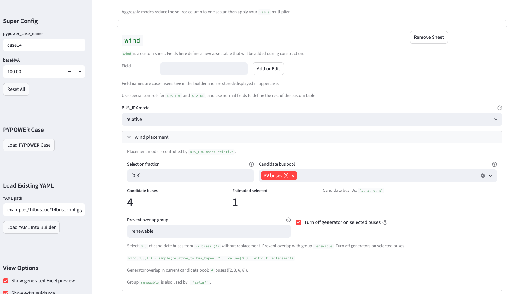
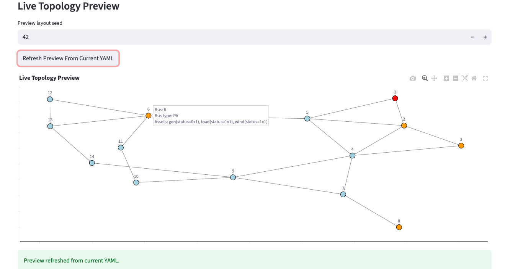

# GridForge

<p align="center">
  
</p>

**GridForge** is a power-system configuration and optimization toolkit.
It helps you:

- build configurable grid cases from YAML,
- export them to Excel workbooks,
- load them into optimization-friendly Python objects,
- attach aligned per-bus time series,
- and write your own CVXPY-based formulations.

GridForge is designed for researchers who want flexible power-system testbeds
without hiding the optimization model behind a rigid DSL.

It also includes:

- a visual YAML builder app,
- plotting helpers for case topology,
- a MATPOWER-to-PYPOWER conversion helper,
- and one optional TX-123BT reference data workflow.

> Note: GridForge can generate configurations and data compatible with CVXPY modeling; solvability still depends on whether the resulting formulation is DCP/DQCP and on the chosen solver, especially for mixed-integer UC. See [the optimization classes supported by CVXPY](https://www.cvxpy.org/tutorial/solvers/index.html#choosing-a-solver).

> Note: GridForge is originally designed for our previous work [LAPSO: Learning Augmented Power System Optimization](https://github.com/xuwkk/lapso_exp). It is now refined and published as a standalone package.

## Installation

**Install from GitHub (recommended)**

```bash
pip install "git+https://github.com/xuwkk/gridforge.git@v0.0.3"
```

**Install latest commit**

```bash
pip install "git+https://github.com/xuwkk/gridforge.git"
```

**Editable install for development (local clone)**

```bash
git clone https://github.com/xuwkk/gridforge.git
cd gridforge
pip install -e .
```

**Optional extras**

```bash
pip install "git+https://github.com/xuwkk/gridforge.git@v0.0.3#egg=gridforge[gurobi]"
pip install "git+https://github.com/xuwkk/gridforge.git@v0.0.3#egg=gridforge[app]"
pip install "git+https://github.com/xuwkk/gridforge.git@v0.0.3#egg=gridforge[full]"
```

## What GridForge gives you

- [`construct_grid_config(...)`](/home/wx/my_project/gridforge/gridforge/construct.py): build a case workbook from YAML
- [`Grid(...)`](/home/wx/my_project/gridforge/gridforge/opt.py): load the workbook into optimization-facing objects
- [`Data(...)`](/home/wx/my_project/gridforge/gridforge/opt.py): load aligned per-bus time-series matrices
- [`gridforge-app`](/home/wx/my_project/gridforge/gridforge/app_cli.py): visually author and inspect YAML configs

## Quickstart

```python
from gridforge.construct import construct_grid_config
from gridforge.opt import Grid, Data

config_yaml = "14bus_config.yaml"
config_xlsx = "14bus_config.xlsx"
data_dir = "14bus_data"

construct_grid_config(config_yaml, config_xlsx, random_seed=404)

grid = Grid(config_xlsx, config_yaml, verbose=0)
data = Data(config_xlsx, data_dir, sheet_names=["load", "solar", "wind"])

print(grid.core.branch.ptdf.shape)
print(grid.core.gen.pmax)
print(data.get_series("load").shape)
```

## Core concepts

After `Grid(...)` is instantiated, the workbook is exposed through three layers:

- `grid.sheets[...]`: raw Excel tables as pandas DataFrames
- `grid.core.*`: schema-defined core sheets such as `bus`, `gen`, `branch`, and `gencost`
- `grid.custom[...]`: generic BUS-backed custom sheets such as `load`, `solar`, and `wind`

The YAML is the source of truth:

- `grid_config`: modify core sheets and add custom sheets
- `rescale`: post-build aggregate balancing rules

The app is a visual YAML builder, not a separate configuration system.

## Worked example: IEEE 14-bus UC

We go through the [IEEE 14-bus system](examples/14bus_uc) as a worked example.

<p align="center">
  
</p>

### Step 1: Construct grid configurations

[PYPOWER](https://github.com/rwl/PYPOWER) provides the base network case. GridForge augments it with YAML-defined rules for:

- modifying core sheets,
- adding custom sheets,
- and applying optional `rescale` rules.

Example:

```python
from gridforge.construct import construct_grid_config

config_path_yaml = "14bus_config.yaml"
config_path_xlsx = "14bus_config.xlsx"
random_seed = 404

construct_grid_config(config_path_yaml, config_path_xlsx, random_seed)
```

This creates an Excel workbook with sheets such as:

- `bus`
- `gen`
- `gencost`
- `branch`
- `load`
- `solar`
- `wind`

GridForge uses unified key columns across sheets:

- bus index: `BUS_IDX`
- status: `STATUS`
- branch endpoints: `F_BUS_IDX`, `T_BUS_IDX`

Detailed YAML schema documentation is available in [config_definition.md](/home/wx/my_project/gridforge/config_definition.md).

### Optional: Visual config app

<p align="center">
  
</p>
<p align="center">
  
</p>

You can use the built-in Streamlit app as a visual YAML builder:

```bash
pip install "gridforge[app]"
gridforge-app
```

If you also want the plotting dependencies commonly used with the app and the
worked example, you can install:

```bash
pip install "gridforge[full]"
```

If you are working from a local source checkout, this also works:

```bash
streamlit run gridforge/config_app.py
```

The app supports:

- selecting `super_config` values,
- adding/removing sheets,
- adding/editing field rules,
- authoring `BUS_IDX` placement,
- authoring `rescale` rules,
- previewing YAML, sheets, and topology,
- running `construct_grid_config(...)` directly.

The YAML remains the source of truth.

### Step 2: Load Grid/Data and build an optimization model

GridForge provides three optimization-facing classes:

- `Grid`: grid workbook access
- `Data`: aligned per-bus time series
- `OptModel`: thin CVXPY model container

Example:

```python
from gridforge.opt import Grid, Data, OptModel

T = 24

data = Data(config_path_xlsx, data_dir, sheet_names=["load", "solar", "wind"])
grid = Grid(config_path_xlsx, config_path_yaml, verbose=0)
m = OptModel(grid)
```

`Data` loads each requested non-core sheet by matching the sheet name to the
same-named column in each per-bus CSV file, case-insensitively.

`Grid` exposes:

- `grid.sheets[...]`
- `grid.core.*`
- `grid.custom[...]`

For example:

```python
print(grid.nbus)                         # number of buses
print(grid.core.gen.pmax)               # generator capacity
print(grid.core.branch.ptdf.shape)      # PTDF matrix
print(grid.custom["load"].Cbus)         # bus-to-load incidence
print(data.get_series("solar").shape)   # (T, nsolar) time-series matrix
```

You can then use:

- `add_variable(...)`
- `add_parameter(...)`
- `add_constraint(...)`
- `add_objective_term(...)`

to build your own optimization formulation.

### Step 3: Solve the optimization problem

Compile the model with parameter values and solve it:

```python
parameters = {
    "load": data.get_series("load")[idx:idx+T, :] / grid.baseMVA,
    "solar": data.get_series("solar")[idx:idx+T, :] / grid.baseMVA,
    "wind": data.get_series("wind")[idx:idx+T, :] / grid.baseMVA,
}
prob = m.compile(**parameters)
prob.solve(solver="GUROBI")
print(prob.status)
```

See the full worked example in [14bus_example.py](/home/wx/my_project/gridforge/examples/14bus_uc/14bus_example.py).

## Reference workflow: TX-123BT

GridForge includes an optional public-data reference workflow based on TX-123BT.
Most users only need the core workflow above.

Fastest path:

```bash
bash scripts/generate_tx123bt_bus_data.sh
```

Optional cleanup of unused raw folders after success:

```bash
KEEP_RAW_DATA=0 bash scripts/generate_tx123bt_bus_data.sh
```

For full dataset details, manual preprocessing steps, and bus-data construction,
see [tx123bt_workflow.md](/home/wx/my_project/gridforge/tx123bt_workflow.md).

## Utilities

GridForge also includes a MATPOWER conversion helper:

- [`convert_matpower_to_pypower(...)`](/home/wx/my_project/gridforge/gridforge/matpower_io.py)

This converts MATPOWER `.m` case files into PYPOWER-style `.py` case files.

## Further reading

- Configuration schema: [config_definition.md](/home/wx/my_project/gridforge/config_definition.md)
- `Grid(...)` access guide: [grid_entries.md](/home/wx/my_project/gridforge/grid_entries.md)
- TX-123BT reference workflow: [tx123bt_workflow.md](/home/wx/my_project/gridforge/tx123bt_workflow.md)
- Full worked example: [14bus_example.py](/home/wx/my_project/gridforge/examples/14bus_uc/14bus_example.py)
